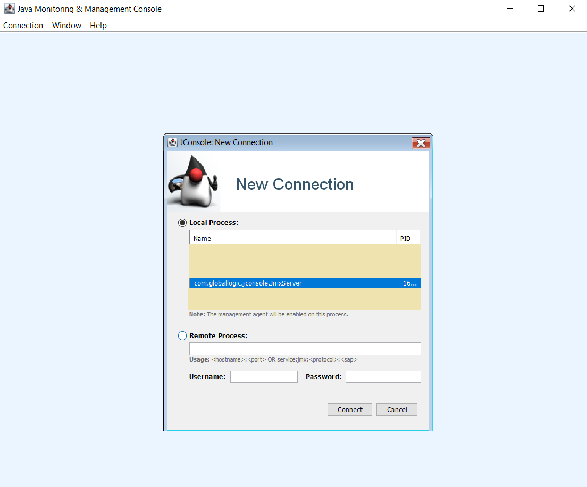

# Java Memory Model and Environment

## Environment
- Java 11 is used for all tasks

## Task1. JConsole
The purpose of this task is to modify the `enabled` property of the `ConditionalLogger` at runtime and disable/enable logging at any time.

### Instructions
1. Using the provided Gradle Wrapper, build and run the project
2. Open JConsole:
   1. Go to `%JAVA_HOME%/bin` (`JAVA_HOME` variable specifies the path where your JDK is located)
   2. Find the `jconsole` executable and run it
   3. Choose your running application in the processes list and press the `Connect` button:
   
   4. Find the the registered `Logger` in the `MBeans` tab. Open the attributes:
   
   5. Enter the `false` value in the `Value` column and click `Refresh`:
   
   6. Observe that the application logging has stopped
   7. Enter the `true` value in the `Value` column and click `Refresh`
   8. Observe that the application logging has started again

### How to submit the solution
1. Redirect the application output to the `jconsole.log` file in the project root folder while performing steps described above 
2. Commit the log file
   

## Task2. Build
The purpose of this task is to use the standard Java tools for building and running an application.

### Instructions
1. Create a `.bat` or `.sh` script to build and run the application without using Gradle or any other build automation tool.
   - Do not forget to set the `JAVA_HOME` variable
   - Firstly, you would need to compile all provided classes using `javac`
   - Secondly, run the application using `java`

### How to submit the solution
1. Place the script file in the project root folder and commit it.

## Task3. Heap Dump
Heap dump lets you see which objects are stored in memory at the specific moment of time. It is used mostly for debugging and troubleshooting (e.g. to understand which objects caused `OutOfMemoryError` or just application slowness).

### Instructions
1. Build and run the provided project using your custom script or Gradle Wrapper.
2. Go to `%JAVA_HOME%/bin` (`JAVA_HOME` variable specifies the path where your JDK is located)
3. Using the `jmap` executable, create the application heap dump (Refer to documentation to discover the needed options). File name should be `application-dump.hprof`.
4. Open the heap dump using any known tool (For example, [VisualVM](https://visualvm.github.io/))
5. Find object of the `ConditionalLogger` class in the dump and make sure that `enabled` field value is set to `true`. 
6. Change the `enabled` field value to false using JConsole.
7. Without stopping the application, create another heap dump.
8. Note that the `enabled` field value has changed to `false`.

### How to submit the solution
1. Create a screenshot of the found in the previous steps object and place it in the project root folder with the `logger-screenshot` name. 
2. Commit the file.

## Useful materials
- https://docs.oracle.com/javase/tutorial/jmx/mbeans/index.html
- https://docs.oracle.com/en/java/javase/11/tools/javac.html#GUID-AEEC9F07-CB49-4E96-8BC7-BCC2C7F725C9
- https://www.baeldung.com/java-heap-dump-capture
- https://docs.oracle.com/en/java/javase/11/tools/jmap.html#GUID-D2340719-82BA-4077-B0F3-2803269B7F41